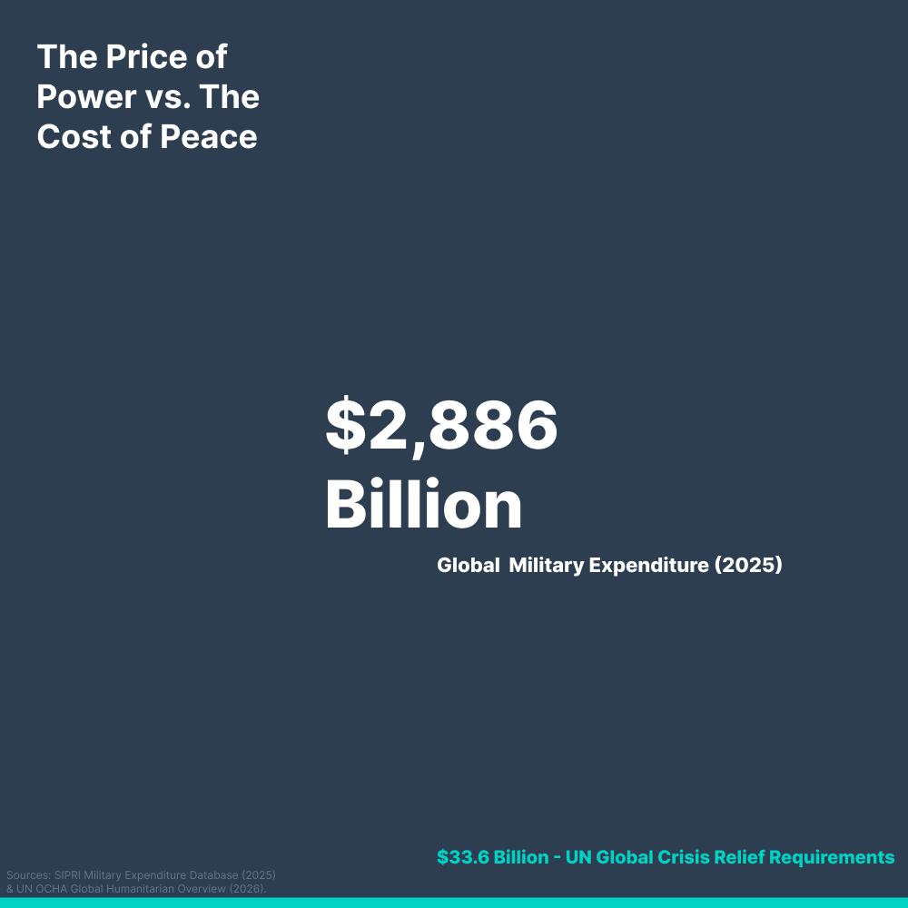

# The Price of Power vs. The Cost of Care
### An Information is Beautiful Data Study on Global Resource Allocation


*(Caption: Proportional 1,000x1,000 pixel Treemap comparing 2025 Global Military Expenditure against 2026 UN Global Humanitarian Crisis Requirements.)*

---

> **The Core Insight:** We are frequently told that funding global crisis relief is an insurmountable financial burden. Yet, macroeconomic ledger data reveals that scarcity is an illusion of perspective. While global military spending has reached a historic **$2.88 Trillion**, the total cost to fund every UN emergency humanitarian appeal on Earth is just **$33.6 Billion**. When mapped proportionally, defense apparatuses consume **98.85%** of the shared financial horizon, leaving a razor-thin **1.15%** sliver for global human relief. 

---

## Act I: The Illusion of Scarcity

When global humanitarian organizations appeal for emergency funds to provide food, clean water, shelter, and medical care to millions caught in active crises, the price tag is often viewed by public discourse with hesitation. In 2026, the United Nations' consolidated global emergency appeal requires **$33.66 billion** to address the world's most critical humanitarian flashpoints—a target that routinely faces severe budget shortfalls.

Public debate constantly reinforces the assumption that global crises—famine, forced displacement, epidemic outbreaks—are simply "too expensive" to solve. When organizations ask for billions in emergency aid, it sounds like an insurmountable financial drain on the global economy.

Yet, when we step back and analyze macroeconomic data without political filtering, a striking structural paradox emerges: **we do not have a resource deficit; we have an allocation paradox.**

---

## Act II: The Bare Mathematics of Civilization

To understand our global priorities, we must examine the balance sheets side by side. During the exact same timeframe that humanitarian organizations struggled to secure $33.6 billion, global military expenditures surged to a historic high of **$2,886.57 billion ($2.88 trillion)**.

By merging institutional defense registries from the Stockholm International Peace Research Institute (**SIPRI**) with emergency financial trackers from the UN Office for the Coordination of Humanitarian Affairs (**OCHA**), we remove subjective biases and expose the raw math of human momentum:

| Track of Civilization | Validated Expenditure / Need | Canvas Area (%) | Relative Scale |
| :--- | :---: | :---: | :---: |
| **Defense & Hard Power** *(SIPRI)* | **$2,886.57 Billion** | **98.85%** | **85.8x larger** |
| **Humanitarian Crisis Relief** *(UN OCHA)* | **$33.66 Billion** | **1.15%** | **1x baseline** |

---

## Act III: The Geometry of Human Choice

When these two fundamental human investments—hard power versus humanitarian preservation—are mapped together on a proportional **1,000,000-pixel canvas**, the disparity transforms from an abstract statistical ratio into a visceral physical reality.

The defense apparatus occupies **98.85%** of our shared financial horizon, sitting as a massive, immovable slate-gray monolith (**1,000px × 988.5px**). By contrast, the entire global budget required to treat the world's most acute humanitarian emergencies is compressed into a glowing teal line at the very bottom margin, measuring just **1,1.5 pixels tall** (**1,000px × 11.5px**).

This visualization strips away political rhetoric to present the bare geometry of civilization's choices. It reveals that global military spending is roughly **86 times larger** than the cost of treating every tracked global crisis combined. The data leaves us with a profound, forward-looking question:

*What would happen to global human development if we shifted just 1% of the monolith toward the margin?*

---

## Technical Methodology & Data Pipeline

As an Economist and Data Scientist, I built an automated, verifiable Python extraction pipeline to ensure this visualization remains completely anchored in verifiable facts. Rather than relying on static third-party summaries, the project programmatically parses raw institutional spreadsheets to calculate spatial proportions.

### Data Sourcing
1. **Military Expenditure Data:** Extracted natively from the **SIPRI Military Expenditure Database (1949–2025)**, targeting the master regional totals worksheet to isolate the current macro world expenditure.
2. **Humanitarian Action Data:** Extracted directly from the **UN OCHA Financial Tracking Service (FTS) Global Humanitarian Overview (2026)**, analyzing consolidated inter-agency crisis requirements.

### Automated Python Extraction Pipeline
To guarantee reproducibility, data cleansing and pixel-scaling targets were executed using Pandas and dynamic regex pattern matching:

```python
from pathlib import Path
import pandas as pd

# 1. Dynamically locate raw data repositories
project_root = Path(__file__).parent.parent
sipri_path = project_root / "raw_data" / "SIPRI-Milex-data-1949-2025_v1.2.xlsx"
ocha_path = project_root / "raw_data" / "plan_table_humanitarian_action_2026.xlsx"

# 2. Extract SIPRI Global Military Totals (bypassing metadata offset)
df_sipri = pd.read_excel(sipri_path, sheet_name="Regional totals", skiprows=13)
df_sipri.columns = [str(col).strip() for col in df_sipri.columns]
world_row = df_sipri[df_sipri[df_sipri.columns[0]].astype(str).str.strip() == "World"]
military_total = float(world_row[df_sipri.columns[-3]].values[0]) # Target: $2,886.57B

# 3. Extract UN OCHA Global Crisis Requirements (with currency string stripping)
df_ocha = pd.read_excel(ocha_path, sheet_name="Export data", skiprows=2)
df_ocha.columns = [str(col).strip() for col in df_ocha.columns]
req_col = [col for col in df_ocha.columns if 'require' in col.lower()][0]

clean_series = df_ocha[req_col].astype(str).str.replace('$', '', regex=False).str.replace(',', '', regex=False)
df_ocha[req_col] = pd.to_numeric(clean_series, errors='coerce').fillna(0)
humanitarian_total = df_ocha[req_col].sum() / 1e9 # Target: $33.66B

# 4. Calculate Proportional Treemap Canvas Targets
total_pool = military_total + humanitarian_total
mil_pct = (military_total / total_pool) * 100 # Results in 98.85%
hum_pct = (humanitarian_total / total_pool) * 100 # Results in 1.15%
disparity = military_total / humanitarian_total # Results in 85.8x

print(f"Canvas Mapping Target -> Defense Block Height: {mil_pct * 10:.1f}px")
print(f"Canvas Mapping Target -> Humanitarian Block Height: {hum_pct * 10:.1f}px")